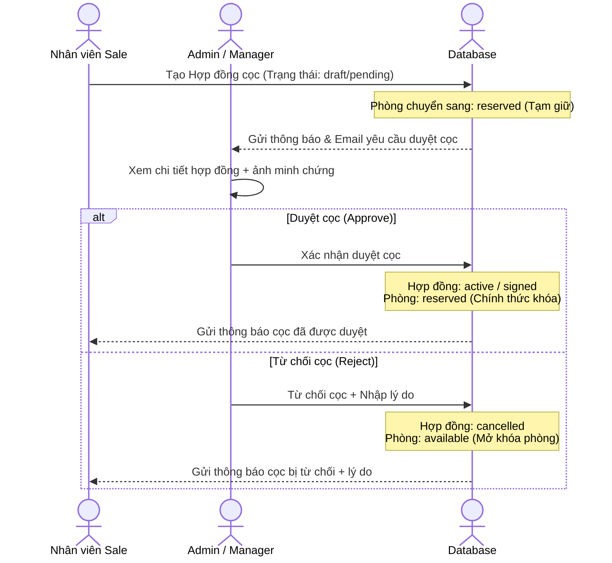
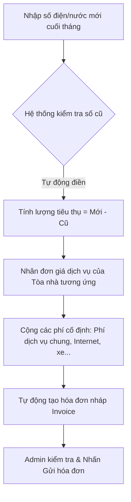

# Kế Hoạch Triển Khai Hệ Thống CRM - Phase 2

Tài liệu này phác thảo kế hoạch chi tiết cho các chức năng nâng cao của hệ thống CRM RealHome nhằm tối ưu hóa quy trình duyệt cọc, xuất bản hợp đồng, tự động hóa tính tiền dịch vụ và đánh giá hiệu năng (KPI) của nhân viên Sale.

---

## 📋 Mục Lục
1. [Module 1: Luồng Duyệt Cọc (Deposit Approval Workflow)](#1-luong-duyet-coc)
2. [Module 2: Xuất PDF & In Hợp Đồng Đặt Cọc](#2-pdf-print-contracts)
3. [Module 3: Tính Toán Hóa Đơn Dịch Vụ Tự Động](#3-automated-billing)
4. [Module 4: Quản Lý & Đánh Giá KPI Nhân Viên](#4-kpi-management)
5. [Lộ Trình Triển Khai (Roadmap)](#roadmap)

---

## 1. Luồng Duyệt Cọc (Deposit Approval Workflow)

### 📌 Quy trình hoạt động (Workflow)

### 🗄️ Thay đổi Database (Dự kiến)
Cập nhật bảng `deposit_contracts`:
* Thêm cột `approved_at` (timestamptz, nullable): Thời gian duyệt.
* Thêm cột `approved_by` (uuid, nullable): ID người duyệt (Admin/Manager).
* Thêm cột `reject_reason` (text, nullable): Lý do từ chối cọc.

### 🖥️ Thay đổi Giao diện (UI/UX)
* **Giao diện Admin:**
  * Thêm cột "Hành động" trong danh sách hợp đồng chờ duyệt.
  * Trong trang chi tiết hợp đồng, bổ sung nút **"Duyệt giao dịch"** (màu xanh lá) và **"Từ chối cọc"** (màu đỏ).
  * Hộp thoại (Dialog) yêu cầu nhập lý do nếu chọn Từ chối.
* **Giao diện Sale:**
  * Nhãn trạng thái hợp đồng: `Chờ duyệt` (vàng), `Đã duyệt` (xanh), `Từ chối` (đỏ kèm tooltip lý do).

---

## 2. Xuất PDF & In Hợp Đồng Đặt Cọc

### 📌 Mục tiêu
Tạo ra bản in hợp đồng chuyên nghiệp trực tiếp từ trình duyệt và cung cấp tính năng tải xuống tệp PDF chuẩn hóa để gửi qua Zalo/Email cho khách hàng.

### 🛠️ Giải pháp kỹ thuật
* **In trực tiếp (Print Preview):** Sử dụng các thẻ CSS `@media print` để ẩn toàn bộ thanh menu sidebar, nút bấm điều hướng và định dạng hợp đồng căn chỉnh đúng khổ giấy A4.
* **Xuất file PDF:** Sử dụng thư viện `@react-pdf/renderer` ở phía server/client để xuất file PDF tĩnh bảo mật.

### 🖨️ Định dạng Mẫu Hợp đồng
* Quốc hiệu tiêu ngữ, Tên Hợp đồng đặt cọc.
* **Bên A (Đại diện Công ty/Chủ nhà):** Tên, SĐT, CCCD, Địa chỉ.
* **Bên B (Khách thuê):** Tên, SĐT, CCCD, Địa chỉ.
* **Thông tin cọc:** Mã phòng, tên tòa nhà, số tiền cọc (bằng số và chữ), ngày ký HĐ thuê chính thức dự kiến.
* Chữ ký điện tử/Khoảng trống ký tên của hai bên.

---

## 3. Tính Toán Hóa Đơn Dịch Vụ Tự Động (Automated Invoice Billing)

### 📌 Quy trình hoạt động

### 🗄️ Thay đổi Database (Dự kiến)
* Đảm bảo tính nhất quán của kiểu dữ liệu giá dịch vụ trong các hợp đồng (`numeric`).
* Cập nhật bảng `invoices` để tự động tham chiếu dữ liệu từ `service_readings` gần nhất.

### 🖥️ Giao diện tính hóa đơn
* Màn hình nhập nhanh chỉ số (Quick Input Grid): Cho phép admin chọn Tòa nhà -> Hiện danh sách toàn bộ các phòng -> Nhập trực tiếp số Điện mới, Nước mới trên 1 bảng thay vì click vào từng phòng.
* Nút **"Tính tiền & Tạo hóa đơn nháp"** hàng loạt chỉ với 1 click.

---

## 4. Quản Lý & Đánh Giá KPI Nhân Viên (KPI Dashboard)

### 📊 Các chỉ số KPI theo dõi (Chu kỳ: Tháng/Quý)
* **Số lead được giao (Leads Assigned):** Đánh giá lượng khách phân bổ.
* **Tỉ lệ chuyển đổi (Conversion Rate):** Số hợp đồng chốt / Số lead được giao.
* **Số cuộc hẹn thành công (Appointments Completed):** Đánh giá mức độ dẫn khách thực tế.
* **Doanh thu đem lại (Revenue Generated):** Tổng số tiền cọc/tiền thuê phòng của các hợp đồng đã ký thành công.
* **Tiến độ đạt mục tiêu (Target Progress):** % Doanh thu thực tế so với chỉ tiêu tháng đề ra.

### 🖥️ Giao diện Dashboard KPI
* **Dành cho Admin/Manager:**
  * Biểu đồ cột so sánh doanh thu của các sale trong tháng.
  * Bảng xếp hạng hiệu suất Sale (Leaderboard).
  * Giao diện cấu hình chỉ tiêu doanh thu (`target_revenue`) cho từng sale đầu tháng.
* **Dành cho từng nhân viên Sale:**
  * Tiến trình KPI cá nhân (Thanh tiến trình trực quan dạng %).
  * Điểm số đánh giá hiệu quả làm việc tự động.

---

## 5. Lộ Trình Triển Khai (Roadmap)

| Giai đoạn | Nội dung công việc | Thời gian dự kiến |
| :--- | :--- | :--- |
| **Tuần 1** | Triển khai **Module 1 (Luồng Duyệt Cọc)** & Cập nhật UI duyệt cọc | 3-4 ngày |
| **Tuần 2** | Triển khai **Module 2 (Tải file PDF/In hợp đồng)** chuẩn A4 | 2-3 ngày |
| **Tuần 3** | Triển khai **Module 3 (Tính toán hóa đơn tự động)** & Nhập chỉ số hàng loạt | 4-5 ngày |
| **Tuần 4** | Triển khai **Module 4 (KPI Dashboard)** & Đánh giá xếp hạng nhân sự | 4-5 ngày |
